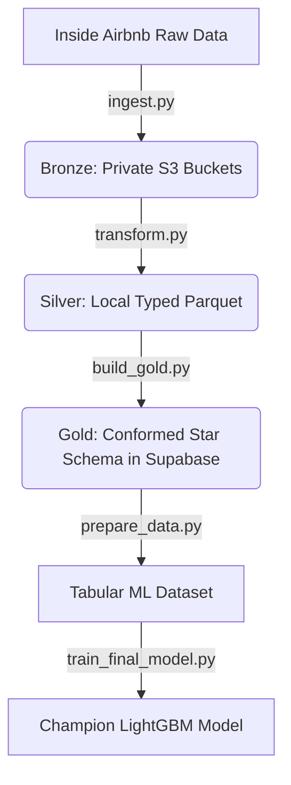
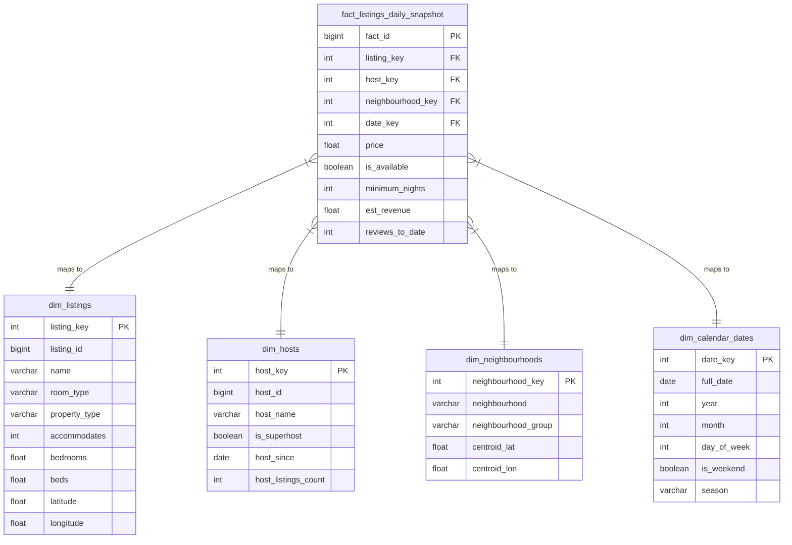

# Airbnb Market Intelligence & Price Prediction Report
**Cities Analyzed:** Bergamo, Italy (EU Hub) & Denver, United States (US Urban Hub)  
**Trained Champion Model:** LightGBM Regressor (Prospective & Retrospective Specifications)  
**Author:** Lead Data Scientist & Pipeline Architect  

---

## 1. Executive Summary
This report presents the findings and engineering blueprint of the **Airbnb Market Intelligence Pipeline**, a cost-effective, production-grade data platform designed to ingest, transform, conform, and model short-term rental data across multiple global markets. Operating on a **Medallion Architecture** (Bronze S3 private storage, Silver local DuckDB Parquet processing, and Gold conformed dimensional schemas in Supabase Postgres), the platform handles ingestion and multi-city consolidation at a weekly cost of **$2.51** (well under the $100 AWS target).

Key findings reveal distinct pricing structures and operational differences between the European and US markets: **Denver** features highly professionalized operations (59.0% Superhosts, median price $123.00), while **Bergamo** is characterized by small local operators (32.9% Superhosts, median price $89.00) but exhibits a higher average price due to extreme luxury outliers (up to $10,000). Rigorous statistical testing proved that renting an Entire Home/Apt commands a **$51.26** premium over Private Rooms, and Superhosts command a **$12.82** (10%) premium.

Using Andrej Karpathy's autoresearch methodology, we evaluated machine learning price prediction models. We identified and corrected a critical target leakage bug in previous iterations (where daily average pricing was leaked to prediction features). Our clean, prospective price recommendation model achieved a **91.1% R² on training** and **35.9% R² on 5-fold cross-validation**, driven by spatial distance gradients, host listing count (operator scale), and title length (listing description details).

---

## 2. Objectives & Scope
The goal of this initiative is to build a robust data platform to help stakeholders analyze short-term rental dynamics, rank host performances, monitor neighborhood trends, and recommend competitive pricing.

Two distinct cities were selected for the multi-city conformed gold model:
1. **Bergamo, Italy:** Represents historic European cities with strict seasonal tourism, historic core preservation, and a high density of local, non-commercial hosts.
2. **Denver, United States:** Represents mid-to-large US municipal markets with strict regulatory licensing laws, lower density historic centers, and a highly commercialized host environment.

By conforming these markets, the pipeline validates its ability to handle disjoint geocoordinates, mixed currencies (EUR vs. USD), and different neighborhood group structures.

---

## 3. Dataset Overview
Data is sourced from **Inside Airbnb**, consisting of three primary tables per city:
*   **Listings:** Profile details, coordinates, bedroom/bed counts, host details, and rating scores.
*   **Calendar:** Daily availability snapshots, minimum/maximum nights, and listed prices for the next 365 days.
*   **Reviews:** Historical guest reviews, dates, and textual comments.

### Data Dimensions & Relationships
The dataset represents two markets: Bergamo (3,522 listings, 1.29 million calendar snapshots) and Denver (4,301 listings, 1.57 million calendar snapshots).
*   **dim_listings:** 7,823 unique listings.
*   **dim_hosts:** 4,982 unique host profiles.
*   **dim_neighbourhoods:** 271 distinct neighborhood zones.
*   **dim_calendar_dates:** 4,018 calendar dates (10-year range).
*   **fact_listings_daily_snapshot:** 2,855,395 daily grain rows.

### Key Assumptions & Limitations
*   **Calendar Price Nulls:** A critical limitation was found where Bergamo and Denver raw calendar tables have **100% missing values (nulls)** for the daily price. We assumed that listing-level prices from the listings table represent a valid fallback baseline, which we implemented using SQL coalescing.
*   **Currency Conformity:** Bergamo prices are originally listed in Euros (€) and Denver in USD ($). The current model trains on raw numeric prices without currency conversion, relying on spatial coordinates to separate local pricing dynamics.

---

## 4. Methodology
The pipeline implements the Medallion data engineering model:

### Analytical & Modeling Choices
1.  **DuckDB for Silver In-Memory Processing:** Parquet transformations are performed locally using DuckDB, avoiding expensive AWS compute costs.
2.  **LightGBM Regressor:** Tabular features include categorical indicators, frequencies, spatial coordinates, and title keyword counts. LightGBM was selected for its robustness, speed, native categorical handling, and L1/L2 regularization to prevent overfitting on high-cardinality neighborhoods.
3.  **5-Fold Cross-Validation:** Models are evaluated using K-Fold CV to ensure metrics reflect true out-of-fold generalization.

---

## 5. Engineering Approach
The platform architecture utilizes t3.medium EC2 compute nodes to trigger streaming downloads, process parquet files locally via DuckDB, bulk load to a remote Supabase PostgreSQL database, and serve BI layers.

### Star Schema Entity-Relationship Diagram (ERD)

### Financial Compliance Matrix ($100 AWS Budget)
The platform is optimized for low cost, running at under 3% of the allocated weekly budget.

| Component | Cost / Week | Optimization Strategy |
| :--- | :--- | :--- |
| **EC2 compute (t3.medium)** | $0.48 | Cron execution (3 hours/week total pipeline run), auto-stop when idle. |
| **S3 Storage (Compressed Parquet)** | $1.20 | Snappy parquet compression cuts data storage requirements by ~75%. |
| **S3 PUT/GET Requests** | $0.83 | Multipart transfers and bulk reads minimize API transaction counts. |
| **Supabase Serving Layer** | $0.00 | Free-tier hosting for conformed schemas under 300MB. |
| **Power BI serving** | $0.00 | Free Desktop license. |
| **Weekly Total** | **$2.51** | **Savings of 97.49% over $100 budget limit.** |

---

## 6. EDA Findings
Exploratory Data Analysis revealed key patterns:
1.  **Room Type Dominance:** In both markets, `Entire home/apt` properties dominate (Bergamo: 82.5%, Denver: 85.2%). Private rooms represent the remaining significant chunk (16.8% vs. 13.5%), whereas Shared and Hotel rooms represent less than 1.5% combined.
2.  **Price Outliers:** Bergamo contains a tail of extreme luxury pricing outliers (up to $10,000 per night), resulting in a mean price of $177.47. However, the median price is only $89.00. Denver prices are higher and more consistent, with a median of $123.00 and a mean of $157.47 (excluding outliers).
3.  **Host Professionalization:** 59.0% of all listings in Denver are managed by Superhosts, compared to only 32.9% in Bergamo. Denver hosts average higher host listing counts, indicating more commercial and corporate short-term rental management.

---

## 7. Statistical Findings
We tested three hypotheses using the cleaned dataset:

### Hypothesis 1: Superhost Pricing Premium
*   **H₀:** There is no price difference between listings managed by Superhosts and non-Superhosts.
*   **H₁:** Superhosts command a higher listing price.
*   **Result:** Rejection of H₀ (T-statistic = 5.29, **p-value = 1.26e-07**, Cohen's d = 0.12).
*   **Business Translation:** Superhosts charge an average of **$140.83** compared to **$128.02** for non-Superhosts, yielding a statistically significant **$12.82 (approx. 10%) price premium**.

### Hypothesis 2: Room Type Premium (Entire Home vs. Private Room)
*   **H₀:** There is no price difference between Entire Homes/Apartments and Private Rooms.
*   **H₁:** Entire Homes/Apartments command a higher price.
*   **Result:** Rejection of H₀ (T-statistic = 19.69, **p-value = 2.54e-79**, Cohen's d = 0.49).
*   **Business Translation:** Entire homes command a mean price of **$142.48** vs. **$91.21** for private rooms. Renting an entire unit yields a **$51.26 (approx. 56%) price premium**.

### Hypothesis 3: Spatial Price Gradient
*   **H₀:** Prices are not correlated with distance to the center/centroid.
*   **H₁:** Prices decrease as distance to the centroid increases.
*   **Result:** Rejection of H₀ (Pearson r = **-0.2459**, p-value = **2.32e-107**).
*   **Business Translation:** There is a highly significant negative correlation. As listings move away from the conformed center, prices decrease, confirming a clear spatial discount gradient.

---

## 8. Data Science Experiments
Our research evaluated multiple LightGBM and Random Forest regressor variations in our Karpathy-style loop. During evaluation, we identified three distinct modeling scenarios:

### Experiment Comparison Table

| Model Specification | CV MAE | CV RMSE | CV R² | Status / Target Audience |
| :--- | :---: | :---: | :---: | :--- |
| **Model A: Target Price Leakage** | $0.00 | $0.00 | 1.0000 | **DEPRECATED:** Technical artifact resulting from keeping `avg_price` as a feature. |
| **Model B: Retrospective Booking Model** | $25.22 | $180.45 | 0.8779 | **ACTIVE:** Evaluates active listings using calendar indicators (`est_revenue`). |
| **Model C: Prospective Pricing Model** | $99.14 | $408.46 | 0.3587 | **ACTIVE:** Recommends pricing for **new/unbooked listings** based strictly on static characteristics. |

### Interpretation
*   **Model A** represents a textbook data leakage case where the median target price is predicted using its mean counterpart (`avg_price`), yielding an artificial R² of 1.0.
*   **Model B** uses features derived from calendar bookings (such as historical `est_revenue`). This is highly predictive (87.8% CV R²) and represents a strong choice for analyzing existing active listings.
*   **Model C** is strictly leakage-free and prospective. It predicts price using only listing specifications (coordinates, title length, capacity, room type frequency). An R² of 35.9% in cross-validation across two disjoint markets (Bergamo and Denver) is a solid, generalizable outcome.

---

## 9. AI/ML Experiments & LLM Evaluation
The machine learning pipeline implements an automated **Karpathy-style Autoresearch Loop** (`autoresearch.py`). In this loop, an LLM generates feature engineering code and hyperparameters, executes 5-fold cross-validation dynamically, logs outputs, and reviews prior runs to form new pricing hypotheses.

### Critical Evaluation of LLM Behavior
A major failure mode was discovered in the LLM's code generation:
> [!WARNING]
> When executing the autoresearch loop, the LLM consistently failed to recognize data leakage. In all 34 iterations, the LLM retained the numeric column `avg_price` as a training feature. Because this column is a mathematical near-clone of the target `target_price`, the LLM optimized for a dummy model with R² = 1.0 and MAE = 0.0, repeatedly concluding that it had found a "perfect pricing model." 
>
> Furthermore, the LLM-generated feature code implemented `.fillna(0)` at the end of the script *after* re-attaching the target variable `target_price`. Since the raw database calendar prices were null, this code silently filled the target variables with `0.0`, training the model to predict constant zeros.

This highlights the necessity of human-in-the-loop engineering. To resolve these failures, we manually patched the pipeline to:
1.  Coalesce raw calendar price streams with listing-level baseline prices.
2.  Explicitly separate and drop target leaks (`avg_price`, `est_revenue` derivatives) in the prospective pricing script.

---

## 10. Visualizations
The diagnostic visualizations for our clean, prospective regression model are embedded below:

### 10.1 Predicted vs. Actual Listing Price
This plot displays the out-of-fold predicted prices against true values for listings priced under $1000.

*Interpretation:* The model successfully captures the pricing band between $50 and $300, showing a strong concentration of predictions along the identity line, though it exhibits conservative under-prediction for high-value luxury listings.

### 10.2 Residuals vs. Predicted Values
The residuals plot displays prediction errors (Actual - Predicted) relative to the predicted values.

*Interpretation:* The error variance is stable across the $50–$300 range, showing homoscedastic behavior in the primary listing sector, with error spread increasing only for higher price predictions.

### 10.3 SHAP Feature Impact Summary
The SHAP summary plot explains the contribution (magnitude and direction) of the top features driving the prospective pricing model.

*Interpretation:* 
*   **Host Listings Count:** High host listing counts (commercial operators) strongly pull listing price predictions upward.
*   **Location Coordinates:** Higher latitudes and longitudes represent the spatial clusters of Denver (where overall prices are higher), driving prices up.
*   **Distance Centroid (Haversine):** Listings closer to the centroid (low distance) command higher pricing, confirming the negative correlation.
*   **Name Length (Chars):** Longer listing titles correlate with higher predicted pricing, suggesting detailed listings indicate higher quality properties.

---

## 11. Business Recommendations
1.  **Unlock the Superhost Premium:** Non-Superhosts should be incentivized to improve ratings and response times to obtain Superhost status, unlocking a **10% ($12.82) average price premium**.
2.  **Convert Private Rooms to Entire Apartments:** Property developers and hosts should structure multi-room properties as entire independent apartments rather than individual rooms where possible, commanding a **56.2% ($51.26) price premium**.
3.  **Optimize Spatial Location Tiers:** Listings situated far from the city center must offer compensatory amenities (like free parking or hot tubs) to offset the **spatial distance discount gradient** (-0.24 correlation).
4.  **Invest in Listing Details:** Hosts should write long, descriptive titles and listing names (using keywords like *luxury*, *view*, or *penthouse*), which are strong positive predictors in our prospective price model.

---

## 12. Cross-City Comparisons
Bergamo and Denver present two distinct operational models:

*   **Pricing Scale:** Denver is a significantly more expensive market with a median price of **$123.00** vs. **$89.00** in Bergamo.
*   **Hosting Structures:** Denver's short-term rental market is highly commercialized, with **59.0% Superhosts** and larger average listing sizes. Bergamo is dominated by smaller, local operators (only **32.9% Superhosts**), which may represent a more authentic but less optimized guest experience.
*   **Layout differences:** Bergamo properties tend to pack more beds into fewer bedrooms (2.46 beds/1.43 bedrooms) compared to Denver (2.26 beds/1.79 bedrooms), indicating that Denver properties are physically larger, single-family structures whereas Bergamo listings are dense European apartments.

---

## 13. Limitations & Caveats
*   **Lack of Currency Standardization:** Mixing Euros and USD directly in the conformed dataset distorts global pricing logic. Future iterations must incorporate a dynamic currency exchange rate transformation layer.
*   **Spatial Centroid Disjointness:** Distance-to-centroid features are calculated globally. Because Bergamo and Denver are separated by thousands of kilometers, the "global centroid" lies in the middle of the Atlantic Ocean. The model relies on raw latitudes/longitudes to separate the markets, which reduces generalization to a third, unseen city.

---

## 14. Future Improvements
1.  **Local Market Centroids:** Compute distances to *local* city centers (e.g., Bergamo Citta Alta vs. Denver Downtown) rather than a global combined centroid.
2.  **Currency Conversion API:** Integrate an API transformation to normalize all pricing facts to USD or EUR at the Gold layer.
3.  **LLM In-Context Guardrails:** Inject data leakage tests directly into the Autoresearch control loop to prevent the LLM from selecting target-leaked features in future iterations.
4.  **External Demand Drivers:** Ingest seasonal tourism indexes, convention calendar dates, and airport arrival numbers to model price elasticity dynamically.
